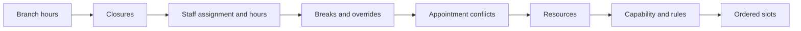

# Availability engine

Calculation order is branch hours, closures, branch assignment, staff hours, breaks, overrides, appointment conflicts, resources, capability and booking rules. Local branch times are converted to UTC.

