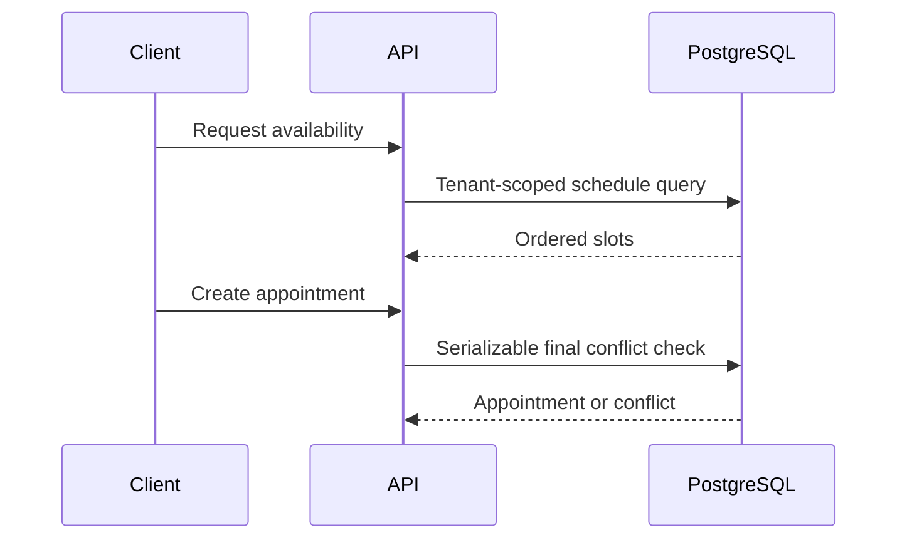
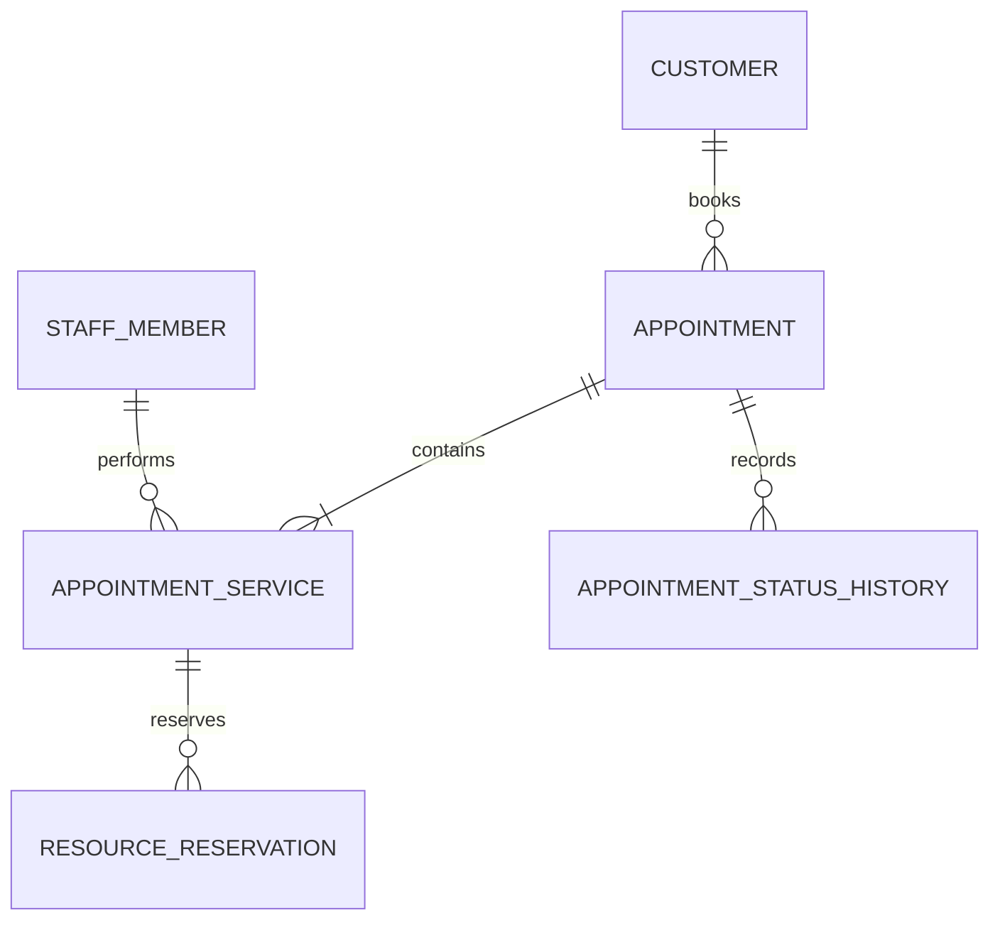

# Booking engine

Appointment is the booking and operational aggregate. Creation uses a serializable PostgreSQL transaction, final conflict check, immutable pricing and duration snapshots, and idempotency architecture.

